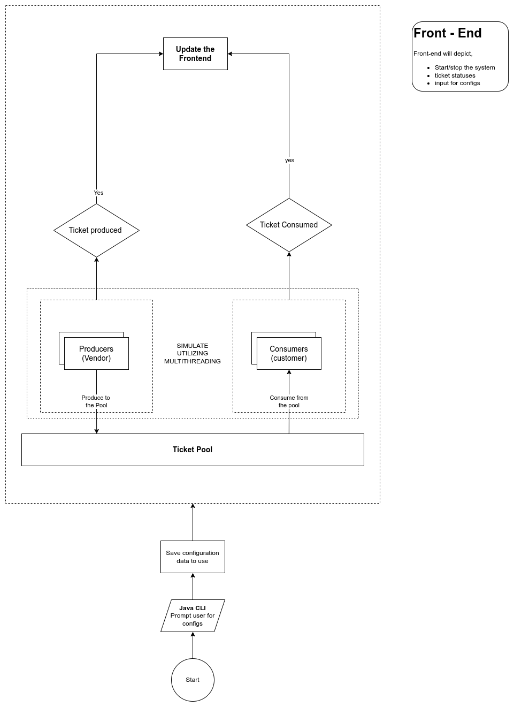

# Real-Time Event Ticket System Backend


---

A robust real-time simulation of an event ticketing system, offering a WebSocket-based interface, REST API, and CLI for seamless interaction.

---

## Table of Contents
1. [Overview](#overview)
2. [Features](#features)
3. [System Architecture](#system-architecture)
4. [Tech Stack](#tech-stack)
5. [Installation](#installation)
6. [Configuration](#configuration)
7. [Usage](#usage)
   - [CLI Commands](#cli-commands)
   - [REST API](#rest-api)
   - [WebSocket](#websocket)
8. [Authors](#authors)

---

## Overview

The Real-Time Event Ticket System is designed to simulate ticket production, consumption, and management using modern backend technologies. It features ticket producers, consumers, a WebSocket server for real-time updates, and a REST API for configuration management. Built with concurrency and thread safety in mind, it efficiently handles real-time ticket operations.

---

## Features

- **Real-Time Updates**: Receive live ticketing updates via WebSocket.
- **REST API**: Manage ticket configurations and monitor the system status.
- **Concurrency Management**: Thread-safe operations using custom locks.
- **Dynamic Configurations**: Adjust ticket pool size and system settings on the fly.

---

## System Architecture

The system comprises the following components:
1. **Producers**: Generate tickets based on predefined configurations.
2. **Consumers**: Process tickets from the pool in real-time.
3. **WebSocket Server**: Streams real-time updates to connected clients.
4. **REST API**: Enables CRUD operations for system configurations.



---

## Tech Stack

- **Backend**: Spring Boot (Java), WebSocket, RandomAccessFile for logging.
- **Database**: MySQL
- **Concurrency**: Custom lock-based queue implementation.

---

## Installation

### Prerequisites

- JDK 17+
- Maven 3.6+
- MySQL 8.0+

### Steps

1. Clone the repository:

   ```bash
   git clone https://github.com/matheeshaEdu/real-time-event-ticketing-app.git
   cd real-time-event-ticketing-app

   ```
2. Build the project:
   ```bash
   mvn clean install
   ```
3. Run the application:
   ```bash
    java -jar target/ticketing-app-0.0.1-SNAPSHOT.jar
    ```
4. Access the application at `http://localhost:8080`.
5. Access the CLI via terminal.

---

## Configuration
The application can be configured using the configuration file located at `src/main/resources/config.properties`.
- **`maxThreadCount`**: Maximum number of threads for ticket producing or consuming.
- **`consumeTime`**: Time taken to consume a ticket in milliseconds.
- **`produceTime`**: Time taken to produce a ticket in milliseconds.
- **`simulationVendors`**: Number of dummy vendors to simulate.
- **`simulationTickets`**: Number of dummy tickets to simulate.
- **`simulationCustomers`**: Number of dummy customers to simulate.

---
## Usage

### CLI Commands
- **`1`**: Display real time log.
- **`2`**: View ticket configuration.
- **`3`**: Update ticket configuration.
- **`4`**: Start ticket simulation.
- **`5`**: Stop ticket simulation.
- **`6`**: Exit.

Type the command number and press `Enter` to execute.
Type `exit` to exit the CLI.

### REST API

#### Get Ticket Configuration
```http
GET /api/v1/userConfig/get
```

#### Set Ticket Configuration
```http
POST /api/v1/ticketConfig/set
Content-Type: application/json

{
    "totalTickets": 100,
    "ticketReleaseRate": 15,
    "customerRetrievalRate": 10,
    "maxTicketCapacity": 18
}
```

#### Get top 6 vendors with the highest number of tickets sold
```http
GET /api/v1/transaction/topVendors
```

#### Start ticket simulation
```http
GET /api/v1/simulation/stop
```

#### Stop ticket simulation
```http
GET /api/v1/simulation/start
```

#### Get ticket simulation status
```http
GET /api/v1/simulation/status
```

### WebSocket

#### Connect to WebSocket
```http
ws://localhost:8080/ws
```
#### Log streaming topic
```http
/topic/logs
```
#### Latest ticket produced count topic
```http
/topic/ticket-produced
```
#### Latest ticket consumed count topic
```http
/topic/ticket-consumed
```
---

## Authors
- 